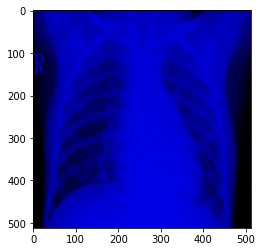

# Dataset 4C-D

The Dataset consists in a file with 3099 images in RGB scale  (Information is only on one channel to avoid overtraining), divided in 4 classes. There are 2169 training images, 465 validation images and 465 test images. (70% for training, 15% for validation and 15% for testing)

The images are getting from:

    Kermany, Daniel & Goldbaum, Michael & Cai, Wenjia & Valentim, Carolina & Liang, Hui-Ying & Baxter, Sally & McKeown, Alex & Yang, Ge & Wu, Xiaokang & Yan, Fangbing & Dong, Justin & Prasadha, Made & Pei, Jacqueline & Ting, Magdalena & Zhu, Jie & Li, Christina & Hewett, Sierra & Dong, Jason & Ziyar, Ian & Zhang, Kang. (2018). 
    Identifying Medical Diagnoses and Treatable Diseases by Image-Based Deep Learning. 
    Cell. 172. 1122-1131.e9. 10.1016/j.cell.2018.02.010. 
    https://www.kaggle.com/paultimothymooney/chest-xray-pneumonia 
    
    Joseph Paul Cohen and Paul Morrison and Lan Dao
    COVID-19 image data collection, arXiv:2003.11597, 2020
    https://github.com/ieee8023/covid-chestxray-dataset

hdf5 file created by:

    Author: Sergio Luis Beleño Díaz
    Date: 2020-04-04

The classes are:

    Normal: 1000
    Pneumonia Vir: 1000
    Pneumonia Bact: 1000
    COVID-19: 99

Labels:

    Normal ==> 0
    Pneumonia Vir ==> 1
    Pneumonia Bact ==> 2
    COVID-19 ==> 3
    
Size:

    (512,512,3)

With the Dataset4C_D_RGB.hdf5 file you can see all channels

Information only on one channel

# How to implement it

You can find an example of implementation in the following link: 

https://github.com/Serbeld/Dataset-4C-D/blob/master/ColorData_4C_D.ipynb

# How to download it

You can download it (Information only on one channel) in the following link: 

https://drive.google.com/file/d/1k8yJFSWFmTiY-RYXubE6vd5LmzNZybK6/view?usp=sharing

You can download it (RGB Full) in the following link: 

https://drive.google.com/file/d/1Wp_yEimNiUQk97cpIaHXU6_ecQ29Hgh4/view?usp=sharing
