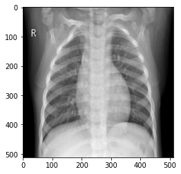

# Dataset 5C

The dataset consists of 6700 RGB scale x-ray images, divided in 5 classes. There are 4690 training images, 1005 validation images and 1005 test images. (70% for training, 15% for validation and 15% for testing)

The images are getting from:

    Kermany, Daniel & Goldbaum, Michael & Cai, Wenjia & Valentim, Carolina & Liang, Hui-Ying & Baxter, Sally & McKeown, Alex & Yang, Ge & Wu, Xiaokang & Yan, Fangbing & Dong, Justin & Prasadha, Made & Pei, Jacqueline & Ting, Magdalena & Zhu, Jie & Li, Christina & Hewett, Sierra & Dong, Jason & Ziyar, Ian & Zhang, Kang. (2018). 
    Identifying Medical Diagnoses and Treatable Diseases by Image-Based Deep Learning. 
    Cell. 172. 1122-1131.e9. 10.1016/j.cell.2018.02.010. 
    https://www.kaggle.com/paultimothymooney/chest-xray-pneumonia 
    
    Joseph Paul Cohen and Paul Morrison and Lan Dao
    COVID-19 image data collection, arXiv:2003.11597, 2020
    https://github.com/ieee8023/covid-chestxray-dataset
    
    Wang X, Peng Y, Lu L, Lu Z, Bagheri M, Summers RM. ChestX-ray8: Hospital-scale Chest X-ray Database and Benchmarks on Weakly-Supervised Classification and Localization of Common Thorax Diseases. IEEE CVPR 2017, http://openaccess.thecvf.com/content_cvpr_2017/papers/Wang_ChestX-ray8_Hospital-Scale_Chest_CVPR_2017_paper.pdf(link is external)
    Images are available via Box: https://nihcc.app.box.com/v/ChestXray-NIHCC(link is external)

hdf5 file created by:

    Author: Sergio Luis Beleño Díaz
    Date: 2020-04-23

The classes are:

    Healthy ====================> 1340 images
    Pneumonia & Covid-19 =======> 1340 images
    Cardiomegaly ===============> 1340 images
    Other respiratory disease ==> 1340 images
    Pleural effusion ===========> 1340 images
    
Labels:

    Healthy ====================> 0
    Pneumonia & Covid-19 =======> 1
    Cardiomegaly ===============> 2
    Other respiratory disease ==> 3
    Pleural effusion ===========> 4
    
Size:

    (512,512,3)
    

# How to implement it

You can find an example of implementation in the following link: 
    
https://github.com/Serbeld/Dataset5C/blob/master/Data_5C.ipynb

# How to download it

You can download the dataset in .hdf5 format at the following link:

https://drive.google.com/file/d/1oPF0Pl8HhUoKt5psaPmMi5MbL9t0Rtf8/view?usp=sharing

You can download the dataset in path format at the following link:

https://drive.google.com/drive/folders/1ktcROowKW7kOgr3up9hW71KVCeJFRVZ6?usp=sharing

You can download the dataset in .zip format at the following link:

https://drive.google.com/file/d/13dwmLxA6680KT0Dxcc_yPWSRQxE0G5zb/view?usp=sharing

## Postscript:

Oversampling was used in class:
    
    Cardiomegaly
    Covid-19 in the Pneumonia & Covid-19 Class 
    
The Other respiratory disease class contains:

    Atelectasis
    Infiltration
    Mass
    Nodule
    Pneumothorax
    Consolidation
    Edema
    Emphysema
    Fibrosis
    Pleural Thickening
    Hernia
    
The rescaling was done under the cubic interpolation method.
